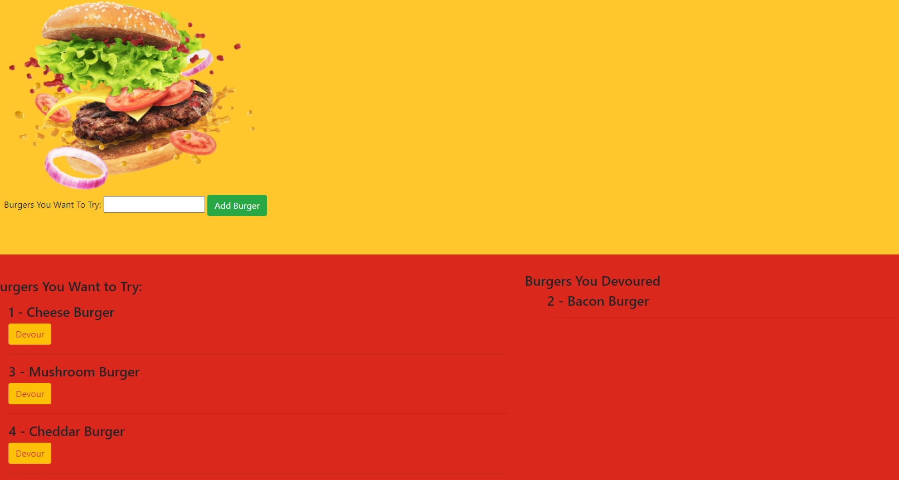

# Eat-Da-Burger

Link to GitHub Repo: https://github.com/dchiev/Burger.git

Link to Deployed Application:  https://sleepy-brushlands-73222.herokuapp.com/

## Process

1. I followed the assignments README to create the directories. 

2. Following the required installs, I created connections and database first. 

3. After the tables were created, I created the `orm.js` to create  the `selectAll()` , `insertOne()`, and `updateOne()` functions.

4. The models were then created to call each function.

5. The `burger_controller.js` was then created for viewing all burgers, creating a new burger, and updating the devoured boolean. 

6. The front end was then created with handlebars. The index calls for the burger responses and will switch the burger to the other side once devoured. 

7. For all the on click events, a seperate javascript file was created to input all the information needed to create a new burger or change the devoured boolean. 